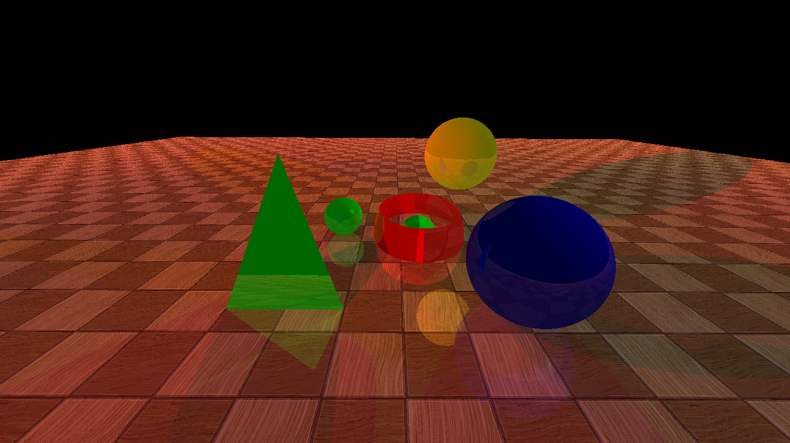

# Open Object World with Ray Tracing

Dive into a 3D-space containing multiple objects of various shapes and color, with a fully controllable camera. Explore
and take pictures. Ray Tracing is used for proper lighting and reflection.



### Controls

| Key | Function | | Key | Function |
|-----|----------|-|-----|----------|
| Up arrow | Move forward | | 1 | Rotate/Look left |
| Down arrow | Move backward | | 2 | Rotate/Look right |
| Left arrow | Move left | | 3 | Look up |
| Right arrow | Move right | | 4 | Look down |
| Page Up | Move up | | 5 | Tilt Counterclockwise |
| Page Down | Move Down | | 6 | Tilt Clockwise |
| Esc | Quit | | 0 | Take picture |

### Requirements

- OpenGL
- g++

On Ubuntu, it's enough to install the `freeglut3-dev` and `g++` packages.

### Execution

Run the `run.sh` shell script, via
```
./run.sh
```

The program will launch. Refer to the controls provided before. When you are ready to take a picture of the current view, press 0. The images will be saved
in `out/` directory. 

### Setting the scene

There are 3 type of objects you can add:
* Triangle
* Sphere
* General Quadric Surfaces

Triangles are defined by three vertices, while Spheres are defined by a center and a radius. For General Quadric Surfaces with equation 
F(x, y, z) = Axx + Byy + Czz + Dxy + Ezx + Fyz + Gx + Hy + Iz + J = 0, the values A, B, C, D, E, F, G, H, I, J are given.

After the description of an object, its color properties follow. Then, the ambient, diffuse, specular and recursive reflection coefficients are provided.
The next line contains the shininess value of the object.

Please refer to [scene.txt](./scene.txt) for a better perception.
